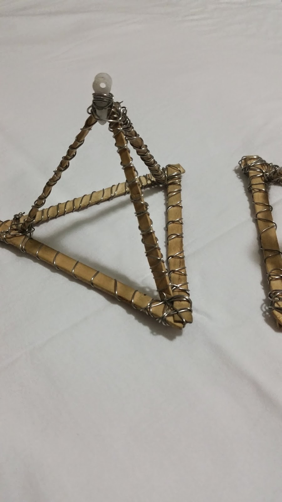
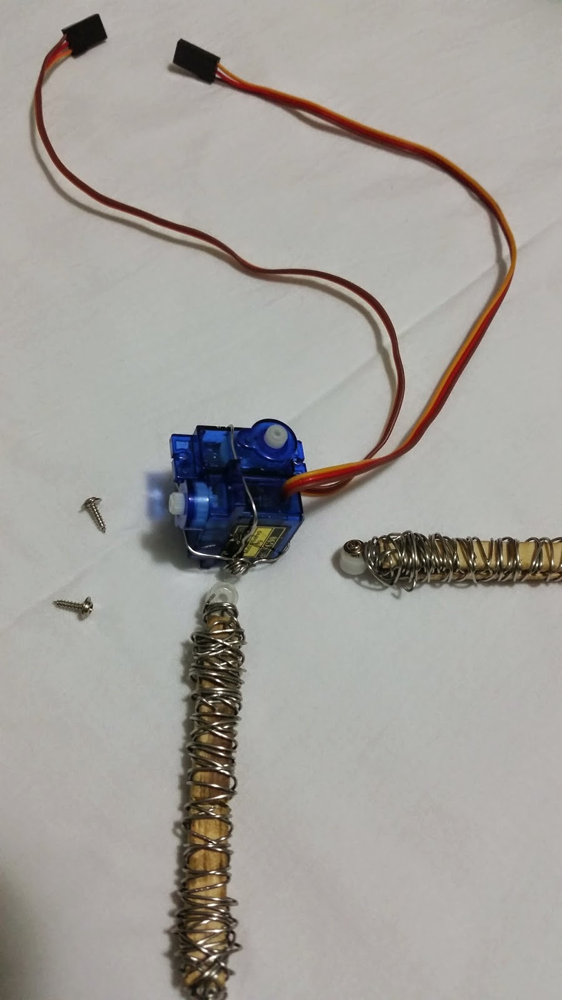
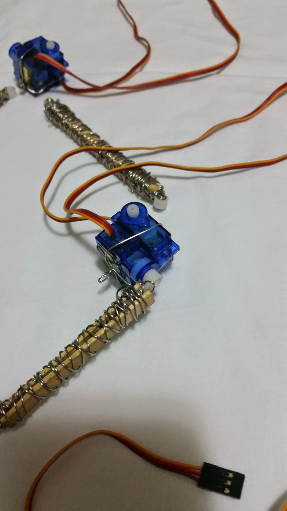
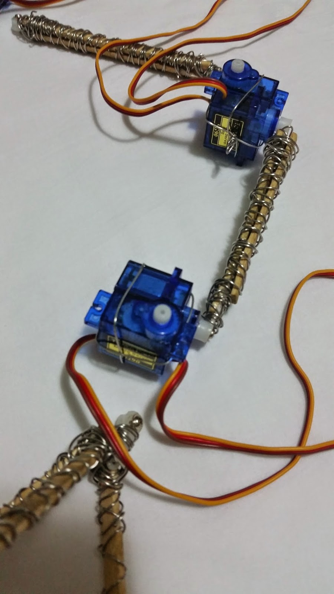
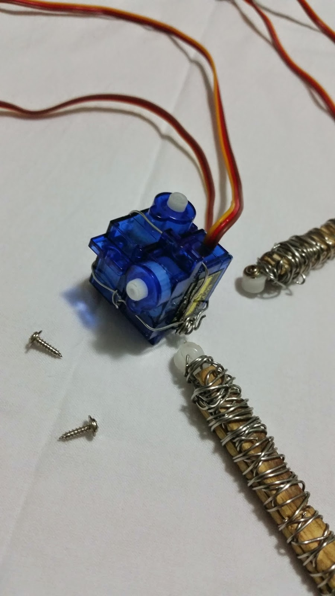
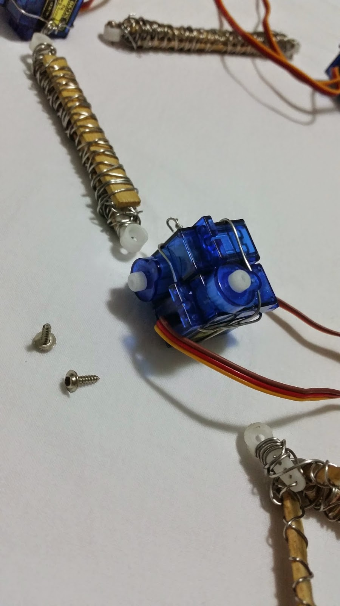
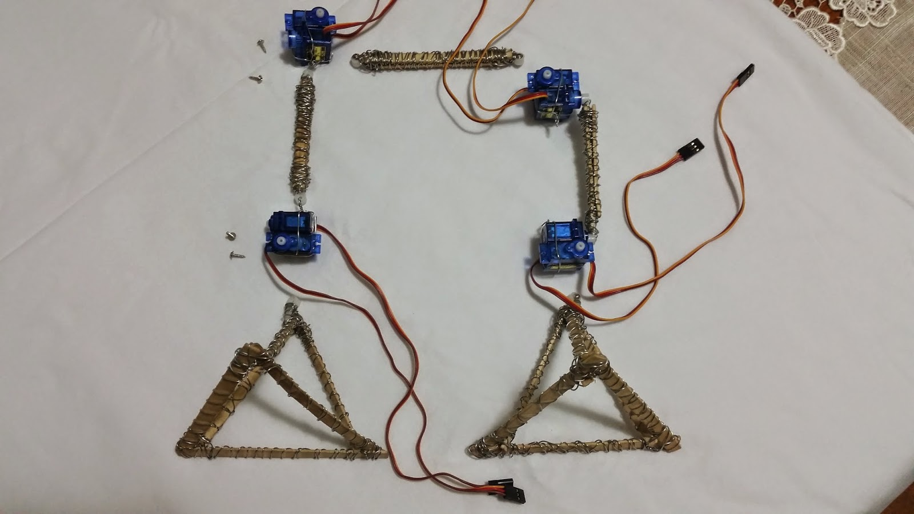
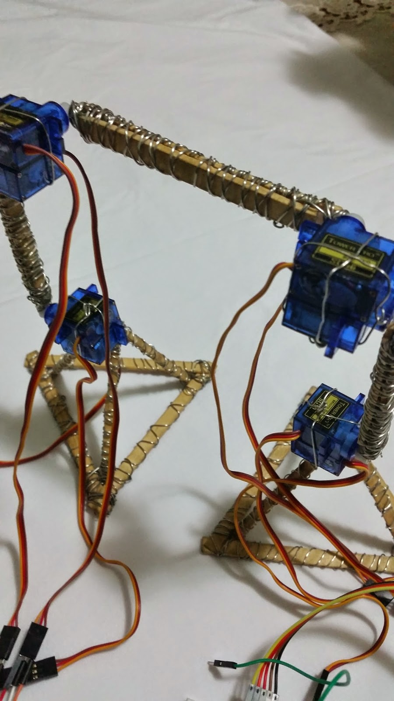
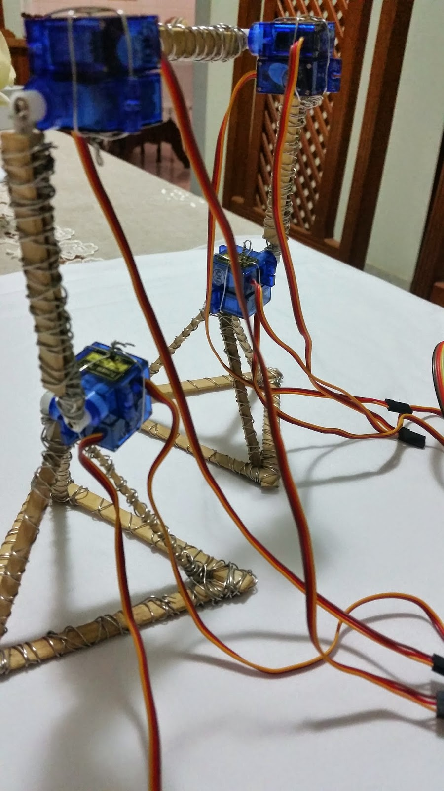
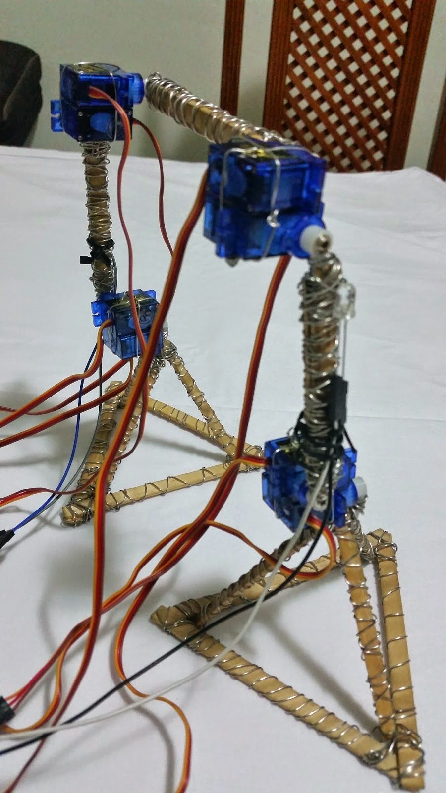

# Morris, the firstborn!
### Summary and purpose

* [Introduction](#Introduction)
* [Material](#Material)
* [Assembly](#Assembly)
* [Programming](#Programming)

That's the prime project I ever cared to document and also the first one I did while in college with my colleague and friend João Saffran. I'm proud that we managed to share the workload and take advantage of our individual abilities in that time to get the job done in record time.

## Introduction
"Morris" was a satisfactorily challenging robot to build. As a biped, a lot of technical stuff was critical, and even a simple step would produce several side-effects that we had to imagine even before the construction.

* Considering that triangles are the most stable geometric shape, yet the one which would use the least amount of material, choosing to build the feet structure based on triangles was an almost obvious decision.
    * Given that while walking, just one foot will have to stand the whole body weight, building a foot big enough to handle that feat was another concern to join the list.
* The robot itself had to be as cheap as possible since as students, we had not much money to buy all the expensive frame parts that a robot like this would require.
    * Was decided then that we would use a cheapest possible (yet strong and easy to modify) structure we could get: Wooden popsicle sticks tied up with steel wire.
* Power a robot with 8 servo motors (even being micro ones) is no easy task since awnkward problems like current consumption peaks could irreversibly damage most Arduino microncontrollers. We also had just our (2) boards to do so at that time.
    * Trying out the idea to split the robot function between two boards successfully handled the case. That even created the oportunity to make further tests involving parallel computing using the boards.
* Coordinate the Arduino boards and consequently the robot actions thru the time, was also a naive challange that we faced just long after it was built. The timing differences between the boards that are caused by the slighest imperfections of their oscillator crystal, caused the robot to stumble over after just one minute of runtime.
    * That problem was out of our sight and had to be solved, so we used a sensor as the arbitrator unit, which would reset both boards into the beginning of their commands list.

**The project can be seen live and running at this [video](https://www.youtube.com/watch?v=o8BQFcMctYs) on YouTube.**

# Material
* **Steel wire**
    * Approximately **20 meters** of **2 milimeter thick** steel wire
* **Sticks**
    * Approximately **20 wooden popsicle** sticks of **8 centimeter length**
* **Arduino**
    * **2 UNO compatible** boards
* **Motors**
    * **8 units** of **9g SG90 micro servo** motors
* **Sensor**
    * **1 LDR** sensor
* **Jump wire**
    * Aproximately **100+ units** of **150 milimiter length** jump wire
    
# Assembly
## Foot
As previously stated, to maximize size and keep stability, each foot is nothing but a tetrahedron or triangular pyramid made of **6 single sticks wrapped with steel wire**.

## Motor blocks and connections
To create a motor block, simply stack two motors so that they look like one from the top and then rotate the top one to the left, hold then togheter and wrap the steel wire to hold them in that position. **That is a very tricky phase and is better to guide using the photos available below.**

The connections between all motor blocks are two sticks togheter wrapped with steel wire in order to withstand the movement without tear itself apart. Remember to place a servo horn at the tip of each connection and wrap them well, Screwing them to the motor blocks is the next job.

## Putting all togheter
That is a straightforward phase, screw everything up and make sure that the initial position of the servo horns are approximately in the 90th motor degree of freedom and if not, unscrew and screw again until all the connections stay around the 90 degrees. That action will avoid awnkward and unexpected movements at the end, when the robot is turned on to walk.

# Programming
It is recommended to use the most updated version of the standard **Arduino IDE** to upload the code into the boards.
The code is maintained in this [Github repository](https://github.com/phtdacosta/morris-robot-project) and can still be updated if needed.

The code can automatically set the frame sequence to be executed by each board. Download the `.ino` file, upload it to each one of the boards and make sure to use a push button attached to the pin 2 of the board which controls the left side and to the pin 3 of the board which controls the right side. The code is simple and any tweaks should be easy to do.

## License
The project is totally **open source** under the **MIT license**.